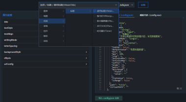

<p align="center">
  
</p>
<h1 align="center">DataV Vue</h1>
<p align="center">
  <a href="https://github.com/pengxiaotian/datav-vue/actions/workflows/main-deploy.yml">
    
  </a>
  <br>
</p>
<p align="center">一个基于 Vue3.x 的数据可视化项目</p>

* 💪 Vue 3.0+
* 🔥 TypeScript 4.2+
* 🔥 ECharts 5.0+

## 关于贡献

我现在有自己的`学习计划`，项目中可能会出现实验性的功能，所以在完成第一个可用版本之前只接受 `fixbug PR`，不接受 `feature PR`。还望大家理解。

## 简介

- [国外 GitHub](https://github.com/pengxiaotian/datav-vue)
- [国内 Gitee](https://gitee.com/pengxiaotian/datav-vue)

### 预览
- [DataV 在线预览](http://datav.pengxiaotian.com)

> 因为项目中的 Mock 服务来自于 `http://rap2api.taobao.org`, 而该服务不支持 `HTTPS`, 还有的浏览器会强制使用 `HTTPS`, 所以如果出现了无法登录的情况, 请检查当前访问的URL是什么协议！

#### 登录页


#### 可视化列表&编辑器
|        |        |
| ------ | ------ |
|      |  |
|||

## CheckList

```
- 页面功能
- [x] 登录页
  * [x] 看板娘
- [x] 首页
  * [x] 可视化管理
    - [ ] 模板
  * [ ] 数据管理
  * [ ] 组件管理
  * [ ] 示例&教程
- [ ] 编辑器
  * [x] 图层面板
  * [x] 组件面板
  * [x] 配置面板
    - [x] 画布属性面板
    - [x] 组件属性面板
    - [ ] 组件数据面板
    - [ ] 组件交互面板
  * [x] 画布/右键菜单/快捷键
    - [x] 截屏/标尺/参考线/组件拖拽/缩放布局
    - [x] 置顶/置底/上移一层/下移一层/解锁/锁定/显示/隐藏/重命名/复制/删除
    - [ ] 框选组件/组合/拆分/撤销/恢复
  * [ ] 其他
    - [ ] 保存/预览/发布

- 基础组件库
- [ ] 柱图
  * [ ] 基本柱状图
  * [ ] 弧形柱图
  * [ ] 折线柱图(多)
  * [ ] 折线柱图
  * [ ] 水平基本柱状图
- [ ] 折线
  * [ ] 基本折线图
  * [ ] 区域图
- [ ] 饼图
  * [ ] 基本饼图
  * [ ] 指标占比图
- [ ] 地图
  * [ ] 基础平面地图
    - [ ] 动态气泡层
    - [ ] 飞线层
  * [ ] 世界地图
- [x] 文本标题
  * [x] 通用标题
  * [x] 数字翻牌器
  * [ ] 跑马灯
  * [ ] 词云
  * [ ] 多行文本
  * [ ] 进度条
  * [ ] 时间器
- [ ] 列表
  * [ ] 轮播列表
  * [ ] 轮播列表柱状图
- [ ] 关系
  * [ ] 树图
- [ ] 媒体
  * [ ] 单张图片
- [ ] 素材
  * [ ] 装饰
  * [ ] 边框
  * [ ] 自定义背景
- [ ] 交互
  * [ ] Tab列表
  * [ ] 全屏切换
  * [ ] Tab选择器
  * [ ] 日期选择器
```

## 安装与使用

```bash
# 初始化项目
yarn bootstrap

# 跑起来！
yarn dev

# 构建发布
yarn build

# 本地预览，需要先执行 build
yarn serve
```

### 新建可视化组件

```bash
yarn new datav
```

### 配置可视化组件

#### 目录结构 (如: main-title):

```bash
main-title
├── index.ts             # 组件入口
└── src
    ├── index.vue        # 组件入口
    ├── main-title.ts    # 组件声明类
    ├── config.vue       # 组件属性配置
    └── config.json      # 用于生成 config.vue 的配置文件
```

#### 使用工具
> 其中 `config.vue` 和 `config.json` 文件，可以在 `development` 模式下，通过访问 `http://localhost:9090/#/dev/props-config` 配置生成。

> 目前还是个简易版生成工具，需要手动将生成的模板代码，复制粘贴到一个新建文件中。

#### 工具预览



### 更多新建选项

- 快速创建一个组件

```bash
yarn gc [component name]
```

- 通过选项模式

```bash
# 创建组件
yarn new component

# 创建 Store
yarn new store
```

### Git提交模板

```bash
yarn cz
```

例子：
```
type(scope?): subject (#issue)

# example: feat(core): add type 'bar' for datav (#123)
```

Git提交模板配置：`./commitlint.config.js` & `./changelog.config.js`

## 国际化
目前只有 `登录页` 进行了国际化设置，有需要可自行添加。

### 添加多语言

多语言文件位置：`@/locales/lang/*.js`

### 使用

- 在模板中使用：
```html
<template>
  ...
    {{ $t('xxx') }}
  ...
</template>
```

- Componsition：
```js
import { useI18n } from 'vue-i18n'

...
setup() {
  const { t } = useI18n({ useScope: 'global' })

  t('xxx')

  return { t }
}
...
```

## 注意

本项目主要用来研究与学习，如果商用请注意：项目里含有一些第三方付费素材，如：`orbitron-bold` 字体。
